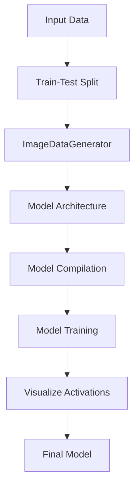

# classify-galaxies
Classifying Galaxies Using Convolutional Neural Networks

```mermaid
graph TD;

A[Input Data] --> B[Train-Test Split]
B --> C[ImageDataGenerator]
C --> D[Model Architecture]
D --> E[Model Compilation]
E --> F[Model Training]
F --> G[Visualize Activations]
G --> H[Final Model]
```
