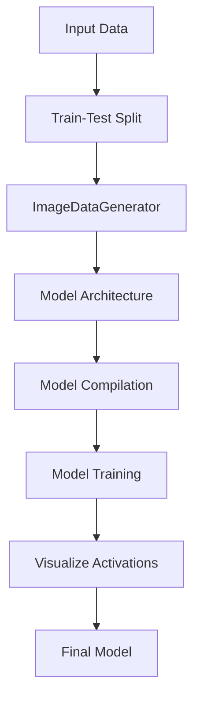

# classify-galaxies
Classifying Galaxies Using Convolutional Neural Networks

"Input Data" represents the initial dataset of galaxy images.
"Train-Test Split" represents the step where the dataset is split into training and testing sets using the train_test_split function from the scikit-learn library.
"ImageDataGenerator" represents the usage of the ImageDataGenerator class from TensorFlow to preprocess the input data, which includes rescaling the pixel values to be between 0 and 1.
"Model Architecture" represents the architecture of the convolutional neural network (CNN) model, which consists of two convolutional layers followed by max-pooling layers, a flatten layer, and two fully connected layers with ReLU and softmax activations, respectively. This is defined using the tf.keras.Sequential class.
"Model Compilation" represents the compilation of the CNN model using the Adam optimizer with a learning rate of 0.001, Categorical Crossentropy loss function, and two evaluation metrics: Categorical Accuracy and AUC (Area Under the Curve). This is done using the compile method of the model.
"Model Training" represents the training of the CNN model on the training data using the fit method of the model. The training is done for 8 epochs and the validation data is used to evaluate the model performance.
"Visualize Activations" represents the visualization of the activations of the CNN layers on the test data using the visualize_activations function from the visualize module.
"Final Model" represents the trained CNN model that can be used for classifying galaxies based on their image data.
